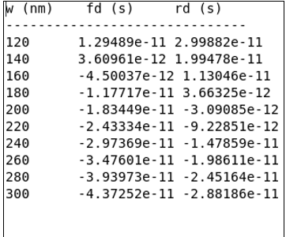
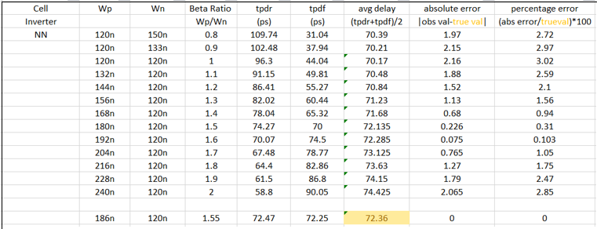
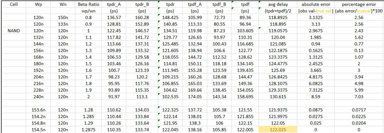
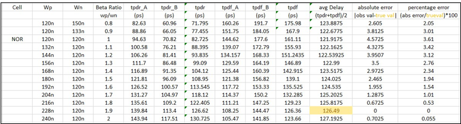

# Beta Ratio Optimization

## Introduction

In CMOS digital circuits, the switching characteristics of PMOS and NMOS transistors are different because electron mobility is higher than hole mobility. As a result, an NMOS transistor is inherently stronger than a PMOS transistor of the same dimensions. To achieve balanced switching behavior, the PMOS transistor width must be increased relative to the NMOS transistor width.

The ratio of PMOS width to NMOS width is referred to as the **beta ratio (β)**.

\[
beta = width of pmos/width of nmos
\]

Selecting an appropriate beta ratio minimizes the difference between rise and fall delays, resulting in balanced circuit performance and improved timing characteristics.

---

# Objective

The objective of beta ratio optimization was to determine the PMOS width that provides balanced switching characteristics while maintaining a fixed NMOS width. The optimized beta ratio was determined individually for each logic cell and later evaluated to identify a common beta ratio suitable for the complete standard cell library.

---

# Methodology

The beta ratio analysis was performed using Cadence Virtuoso and Spectre simulations.

The following procedure was adopted:

- NMOS width was fixed at **120 nm**.
- PMOS width was gradually increased.
- Different beta ratios were obtained by varying the PMOS width.
- Propagation delays were measured for every beta ratio.
- Rise delay and fall delay were compared.
- The beta ratio producing the minimum difference between rise and fall delays was selected as the optimum value for that logic cell.

For the NAND gate, two input combinations were analyzed. One input was held constant while the other was switched. Rise and fall delays obtained from both input combinations were averaged before selecting the optimum beta ratio.

The same methodology was followed for the NOR gate.

---

# Selection Criterion

The optimum beta ratio was selected based on the balance between rising and falling propagation delays.

The beta ratio corresponding to the minimum absolute difference between the two delays was considered the optimum beta ratio for the logic cell.

This approach ensures:

- Balanced switching performance
- Reduced timing skew
- Improved delay symmetry
- Better overall circuit performance

---

# Python Automation

To reduce manual calculations, a Python script was developed to automate delay analysis.

The script was used to:

- Read simulation results
- Calculate propagation delays
- Compute average delay
- Determine absolute error
- Calculate percentage error
- Identify the optimum beta ratio automatically

The use of automation significantly reduced characterization time and minimized calculation errors.

**Figure 3.1:** Sample output generated by the Python script.

---

# Inverter Beta Ratio Analysis

The inverter was analyzed by fixing the NMOS width at **120 nm** and varying the PMOS width.

The optimum beta ratio was obtained when the rise and fall delays were nearly identical, resulting in the minimum absolute error.

### Observations

- NMOS Width = **120 nm**
- Optimum PMOS Width = **186 nm**
- Optimum Beta Ratio = **1.55**

  

<b>Figure 3.1:</b> Inverter Beta Ratio Analysis.

---

# NAND Gate Beta Ratio Analysis

The NAND gate contains two inputs.

To accurately characterize the gate:

- One input was kept constant.
- The second input was switched.
- Delay measurements were repeated for both input combinations.
- The average rise and fall delays were calculated.
- The optimum beta ratio was selected using the minimum absolute error criterion.

### Observations

- NMOS Width = **120 nm**
- Optimum PMOS Width = **154.5 nm**
- Optimum Beta Ratio = **1.2875**

**Figure 3.2:** NAND Gate Beta Ratio Analysis.

---

# NOR Gate Beta Ratio Analysis

The same characterization methodology was applied to the NOR gate.

The optimum beta ratio was determined from the point where the difference between rise and fall delay was minimum.

### Observations

- NMOS Width = **120 nm**
- Optimum PMOS Width = **228 nm**
- Optimum Beta Ratio = **1.90**

**Figure 3.3:** NOR Gate Beta Ratio Analysis.

---

# Selection of Common Library Beta Ratio

Although each logic cell exhibited a different optimum beta ratio, using different PMOS widths for every standard cell would increase library complexity and reduce layout uniformity.

A single beta ratio was therefore selected for the complete standard cell library.

After evaluating the performance trade-offs of all characterized cells, a beta ratio of **1.5** was chosen.

The relationship between transistor widths is:

\[
W_P = 1.5 \times W_N
\]

Since:

- NMOS Width = **120 nm**

Therefore:

- PMOS Width = **180 nm**

This common beta ratio provides a good balance between performance, layout regularity, and ease of library characterization.

The resulting performance degradation is small:

- NAND gate ≈ **2%**
- NOR gate ≈ **1.94%**

These values are considered acceptable for a standard cell library intended for ASIC design.

---

# Conclusion

Beta ratio optimization is an important step in standard cell development because it directly influences propagation delay, switching symmetry, and overall circuit performance.

Individual optimization of the inverter, NAND gate, and NOR gate resulted in different optimum beta ratios. However, adopting a common beta ratio of **1.5** simplifies library development while maintaining excellent timing performance with minimal degradation.

The optimized beta ratio was therefore used throughout the development of the 45 nm standard cell library.
