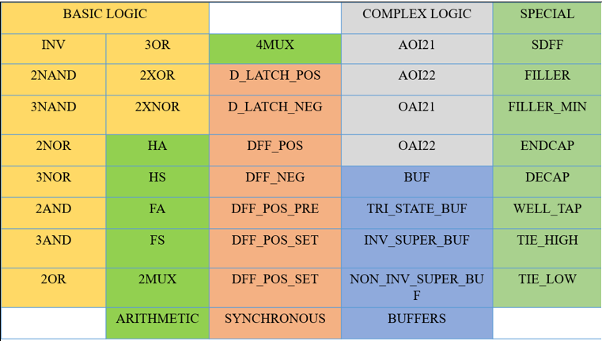
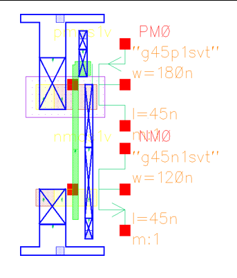

# Layout Development

## Introduction

Layout development is one of the most important stages in standard cell library design. During this stage, the transistor-level schematics are converted into physical layouts that comply with the foundry design rules while achieving compact area, proper routing, and manufacturability.

A well-designed standard cell layout directly influences the overall area, speed, power consumption, and routing efficiency of an ASIC. Therefore, every standard cell in the library was carefully designed and verified using Cadence Virtuoso for the 45 nm CMOS technology.

---

# Objectives

The objectives of layout development were:

- Convert transistor schematics into manufacturable physical layouts.
- Design all standard cells using the 45 nm CMOS design rules.
- Maintain a uniform standard cell height for all cells.
- Minimize layout area through efficient transistor placement.
- Reduce routing complexity using diffusion sharing wherever possible.
- Verify every layout using DRC and LVS.

---

# Standard Cell Layout

A standard cell layout is the physical representation of a digital logic circuit. It consists of different layers such as diffusion, polysilicon, metal layers, contacts, and wells that together implement the required transistor connections.

Each standard cell is designed so that it can be placed beside other cells without violating design rules. To enable automated placement and routing in ASIC design, every standard cell must have the same height while allowing the width to vary according to circuit complexity.

---

# Layout Components

Every standard cell developed in this project consists of the following physical regions.

## PMOS Region

The PMOS transistors are placed inside the N-Well region near the upper portion of the layout.

The source terminals of PMOS devices are connected to the VDD power rail.

---

## NMOS Region

The NMOS transistors are placed below the PMOS region.

Their source terminals are connected to the GND power rail.

---

## Power Rails

Continuous Metal-1 power rails are provided across the entire width of every standard cell.

- Upper rail → VDD
- Lower rail → GND

Having identical power rail locations allows different standard cells to connect seamlessly when placed adjacent to one another.

---

## Polysilicon

Polysilicon is used to form the transistor gates.

Where polysilicon crosses active diffusion, MOS transistors are created. Proper poly spacing is maintained according to the 45 nm technology design rules.

---

## Contacts and Vias

Contacts connect diffusion or polysilicon to the first metal layer, while vias connect one metal layer to another.

Proper enclosure and spacing rules were maintained throughout the layouts to ensure manufacturability.

---

# Routing Pitch

Routing pitch is the minimum center-to-center distance between two adjacent routing tracks.

The routing pitch determines how closely interconnects can be placed while satisfying the foundry design rules.

A properly selected routing pitch provides:

- Reliable routing
- Reduced routing congestion
- Better manufacturability
- Improved signal integrity

The routing pitch depends on:

- Metal width
- Minimum metal spacing
- Via enclosure (overhang)

For the 45 nm technology, the following parameters were used:

| Parameter | Value |
|-----------|--------|
| Metal Width | 0.06 µm |
| Metal-to-Metal Spacing | 0.06 µm |
| Via Overhang | 0.02 µm |

The routing pitch is calculated as:

Pitch = 2 × (½ × Metal Width + Via Overhang) + Metal Spacing

Substituting the values,

Pitch = 2 × (½ × 0.06 + 0.02) + 0.06

= 2 × (0.03 + 0.02) + 0.06

= 0.10 + 0.06

= **0.16 µm**

Thus, the routing pitch used throughout the standard cell library is **0.16 µm**.

---

# Standard Cell Height

Standard cell height is the vertical dimension of a standard cell.

One of the fundamental requirements of a standard cell library is that every cell must have the same height. Uniform cell height allows automatic placement tools to arrange cells in rows, simplifies routing, and ensures compatibility throughout the ASIC design flow.

The standard cell height depends on:

- Routing pitch
- Number of routing tracks

The following relationship was used:

Standard Cell Height = Pitch × (Number of Tracks − 1)

For this project,

- Routing Pitch = **0.16 µm**
- Number of Tracks = **12**

Therefore,

Standard Cell Height = 0.16 × (12 − 1)

= 0.16 × 11

= **1.76 µm**

Hence, every standard cell in the library was designed with a fixed height of **1.76 µm**.

Only the width varies depending on the complexity of the logic function.

---

# Diffusion Sharing

Diffusion sharing is a layout optimization technique in which adjacent transistors share a common diffusion region instead of using separate source and drain regions.

This technique provides several advantages:

- Reduces silicon area
- Decreases parasitic capacitance
- Improves circuit performance
- Reduces fabrication cost

Diffusion sharing was applied wherever possible during layout development while maintaining correct electrical connectivity.

---

# Standard Cell Library

The standard cell library developed in this project consists of a collection of basic logic gates, arithmetic cells, multiplexers, sequential elements, complex logic gates, buffers, and special-purpose cells. Together, these cells form the building blocks required for digital ASIC design.

The library includes the following categories:

- **Basic Logic:** Inverters, NAND, NOR, AND, and OR gates.
- **Arithmetic Cells:** XOR, XNOR, Half Adder (HA), Half Subtractor (HS), Full Adder (FA), Full Subtractor (FS), and Multiplexers.
- **Sequential Cells:** D Latches and D Flip-Flops with different configurations such as positive-edge, negative-edge, preset, and set variants.
- **Complex Logic:** AOI (AND-OR-Invert), OAI (OR-AND-Invert), Buffers, Tri-State Buffers, Inverting Super Buffers, and Non-Inverting Super Buffers.
- **Special Cells:** Scan D Flip-Flop (SDFF), FILLER, FILLER_MIN, ENDCAP, DECAP, WELL TAP, TIE HIGH, and TIE LOW cells.

The layouts developed in this project follow a common standard cell architecture with a fixed cell height of **1.76 µm**. Cells that have been physically implemented were designed using the same layout methodology and verified according to the 45 nm CMOS design rules.

**Figure 4.1:** Standard Cell Library Classification.

---

# Design Rule Check (DRC)

After layout completion, every standard cell was verified using Cadence Virtuoso Design Rule Check (DRC).

DRC ensures that every layout satisfies the manufacturing rules specified for the 45 nm CMOS technology.

The verification checks include:

- Minimum width
- Minimum spacing
- Enclosure rules
- Overlap rules
- Contact dimensions
- Via dimensions

All layouts passed DRC successfully without violations.

---

# Layout Versus Schematic (LVS)

After passing DRC, Layout Versus Schematic (LVS) verification was performed.

LVS compares the electrical connectivity of the layout with the original transistor schematic.

Successful LVS confirms that:

- Correct transistor sizes were used.
- All transistor connections are accurate.
- No opens or shorts exist.
- The fabricated layout matches the intended circuit.

All standard cells successfully passed LVS verification.

---

# Layout Extraction

After successful LVS verification, parasitic extraction was performed.

The extracted view includes parasitic resistances and capacitances introduced by the physical layout.

This extracted netlist provides a more accurate representation of circuit behavior and is used during timing characterization and delay analysis.

**Figure 4.2:** Extracted layout view.

---

# Conclusion

The physical layouts of all standard cells were successfully developed using the 45 nm CMOS technology. Every layout satisfies the foundry design rules, maintains a uniform standard cell height of **1.76 µm**, and follows a common architecture suitable for ASIC implementation.

Through careful transistor placement, diffusion sharing, and verification using DRC, LVS, and extraction, a manufacturable and optimized standard cell library was developed for subsequent characterization and ASIC design applications.
