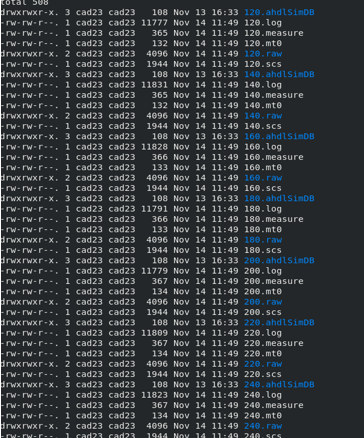
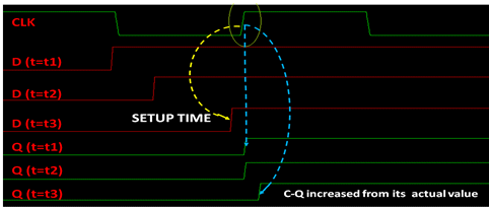
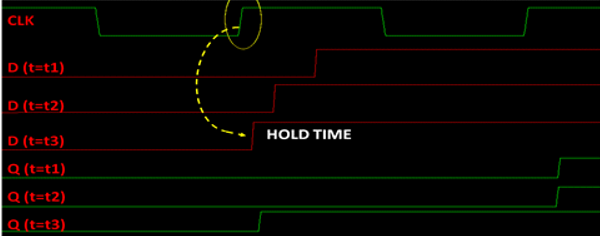
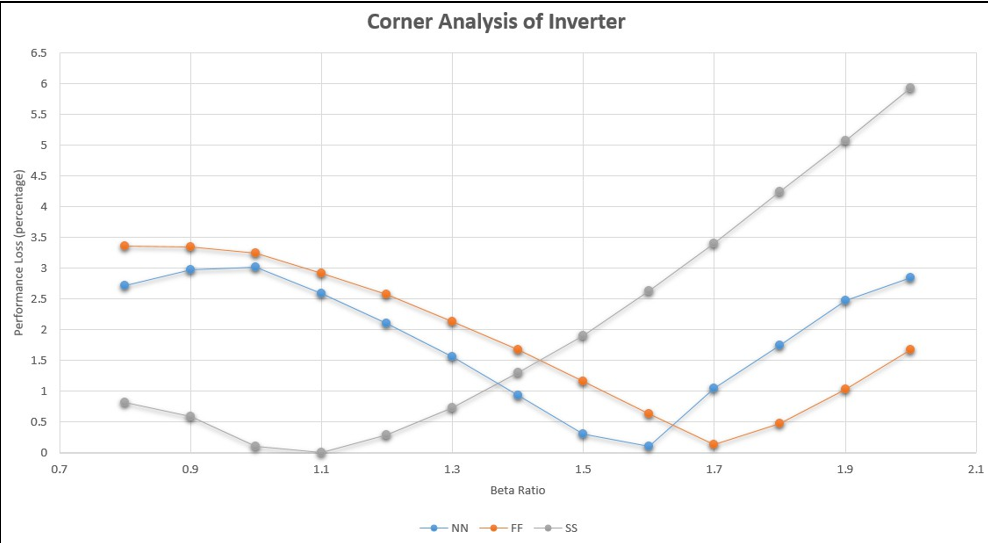

# Timing Analysis and PVT Validation

## Introduction

Timing analysis is one of the most important stages in the development of a standard cell library. It is performed to evaluate the speed, reliability, and robustness of digital circuits under different operating conditions. The timing characteristics of a logic cell determine the maximum operating frequency of a digital system and directly influence the overall performance of an ASIC.

After completing the transistor sizing and layout development, it is necessary to verify that the designed cells satisfy the required timing specifications. This includes measuring propagation delay, setup time, hold time, and evaluating the effect of process, voltage, and temperature (PVT) variations on circuit performance.

In this project, timing analysis was carried out using **Cadence Virtuoso** with the **Spectre simulator**. Propagation delay measurements were performed using the schematic netlists during beta ratio optimization, while setup and hold time analyses were performed after layout development. Furthermore, representative cells were analyzed under different PVT conditions to validate the robustness of the proposed 45 nm CMOS standard cell library.

Unlike commercial standard cell libraries that perform complete characterization for every cell, this work focuses on representative combinational and sequential cells to validate the design methodology and timing performance of the developed library.

---

# Objectives

The objectives of timing analysis and PVT validation are:

- To evaluate the propagation delay of representative logic cells.
- To determine the setup and hold time of sequential circuits.
- To study the influence of process, voltage, and temperature variations.
- To validate the robustness of the selected beta ratio.
- To verify reliable operation of the proposed standard cell library under different operating conditions.

---

# Timing Analysis Methodology

The timing verification methodology adopted in this project is illustrated below.

1. Design the transistor-level schematic.
2. Perform beta ratio optimization.
3. Develop the physical layout.
4. Verify the layout using DRC and LVS.
5. Perform timing analysis.
6. Measure setup and hold time.
7. Evaluate the design under different PVT conditions.
8. Validate the timing performance of the standard cell library.

The timing simulations were carried out using Cadence Spectre simulator. During beta ratio optimization, propagation delay was measured from schematic simulations to determine the optimum PMOS-to-NMOS sizing ratio. After completing the layout verification, sequential timing parameters such as setup time and hold time were analyzed. Finally, Process-Voltage-Temperature (PVT) analysis was performed on representative cells to evaluate the robustness of the proposed library.

---

# Propagation Delay Analysis

Propagation delay is the time required for a change at the input of a logic gate to appear at its output. It is one of the most important performance parameters because it determines the speed of digital circuits.

Whenever the input changes state, the output does not switch instantaneously due to the charging and discharging of internal capacitances. This finite switching time is called propagation delay.

Two propagation delay parameters are commonly measured:

- **Rise Delay (tPLH):** Time required for the output to transition from LOW to HIGH.
- **Fall Delay (tPHL):** Time required for the output to transition from HIGH to LOW.

The average propagation delay is calculated using

\[
t_{pd}=\frac{t_{PLH}+t_{PHL}}{2}
\]

During this work, propagation delay measurements were performed using the schematic netlists of the designed logic gates. These simulations were carried out during beta ratio optimization to determine the optimum transistor sizing for the inverter, NAND gate, and NOR gate.

The measured rise and fall delays were compared for different PMOS widths while maintaining the NMOS width constant at **120 nm**. The optimum beta ratio for each logic gate was selected by minimizing the difference between rise and fall delays.

The obtained optimum beta ratios were:

| Logic Cell | Optimum Beta Ratio |
|------------|-------------------:|
| Inverter | 1.55 |
| NAND Gate | 1.2875 |
| NOR Gate | 1.90 |

Based on these results, a common beta ratio of **1.5** was selected for the proposed standard cell library. This provides balanced switching characteristics while maintaining a uniform transistor sizing strategy across different cells.

**Figure 5.1:** Spectre Simulation Testbench.

---

# Setup and Hold Time Analysis

Sequential circuits such as latches and flip-flops require input data to remain stable around the active clock edge. If the input changes too close to the clock transition, incorrect data may be captured, leading to timing violations.

The two most important timing parameters for sequential circuits are **setup time** and **hold time**.

## Setup Time

Setup time is the minimum duration for which the input data must remain stable **before** the active clock edge of the clock signal. If the data changes within this interval, the flip-flop may fail to capture the correct value or enter a metastable state.

To determine the setup time of the designed flip-flop, the following procedure was adopted:

1. A clock signal with a pulse width of **10 ns** (100 MHz frequency) was applied.
2. Initially, the data transition from **0 → 1** was placed **10 ns before** the active clock edge. At this point, the data arrives much earlier than required and is therefore assumed to have **infinite setup time**.
3. The **Clock-to-Q (C-Q) delay** was measured from the **50% point of the clock edge** to the **50% point of the output transition**.
4. The input data transition was then gradually moved closer to the active clock edge while measuring the corresponding C-Q delay.
5. For each simulation, the measured C-Q delay was compared with the reference value obtained under infinite setup time conditions.
6. When the C-Q delay increased by approximately **10%** compared to the reference delay, the corresponding data arrival instant was identified.
7. The time difference between the data transition and the active clock edge at this point was recorded as the **setup time** of the flip-flop.

### Infinite Setup Time

Infinite setup time does **not** imply an actual infinite duration. It refers to a condition in which the input data is applied **sufficiently earlier than the clock edge**, ensuring that the flip-flop has ample time to capture the input without any timing limitation.

In this work, a data transition occurring **10 ns before the active clock edge** was considered as an infinite setup time because it is much larger than the actual setup time of the flip-flop. This condition serves as the reference for measuring the Clock-to-Q delay.

**Figure 5.2:** Setup Time Measurement.

---

## Hold Time

Hold time is the minimum duration for which the input data must remain stable **after** the active clock edge. If the data changes before this interval has elapsed, the flip-flop may capture incorrect information.

The hold time of the flip-flop was measured using the following procedure:

1. A clock signal with a pulse width of **10 ns** (100 MHz frequency) was applied.
2. Initially, the data transition from **0 → 1** was placed **10 ns before** the active clock edge. This condition represents an **infinite hold time**, where the input remains stable well beyond the required hold interval.
3. The data transition was gradually shifted closer to the active clock edge.
4. The point at which the output successfully transitioned from **0 → 1** was observed.
5. The time difference between the active clock edge and the data transition at this limiting condition was recorded as the **hold time** of the flip-flop.

### Infinite Hold Time

Similar to infinite setup time, **infinite hold time** is a reference condition rather than a physically infinite interval. It indicates that the input data remains stable for a duration that is significantly longer than the expected hold time requirement.

By starting from this safe operating condition and progressively reducing the timing margin, the minimum hold time required for reliable operation can be accurately determined.

**Figure 5.3:** Hold Time Measurement.

The measured setup time and hold time were subsequently used for PVT analysis to evaluate the timing robustness of the designed sequential cells under different operating conditions.
---
# Process, Voltage and Temperature (PVT) Analysis

Integrated circuits rarely operate under ideal conditions throughout their lifetime. Variations in semiconductor manufacturing, supply voltage, and operating temperature influence transistor characteristics, which in turn affect circuit speed, power consumption, and reliability.

To ensure that a standard cell library performs correctly under practical operating conditions, it is necessary to evaluate its behaviour using **Process-Voltage-Temperature (PVT)** analysis. This analysis verifies that the designed cells continue to function reliably despite variations introduced during fabrication and operation.

The PVT analysis performed in this project focuses on representative combinational and sequential cells to validate the robustness of the proposed 45 nm CMOS standard cell library.

---

# Process Variation

Process variation refers to the unavoidable differences that occur during semiconductor fabrication. These variations slightly modify transistor parameters such as threshold voltage, channel length, oxide thickness, and carrier mobility.

To evaluate these effects, three standard process corners were considered.

- **TT (Typical-Typical):** Represents nominal fabrication conditions.
- **FF (Fast-Fast):** Represents faster NMOS and PMOS devices with higher drive strength.
- **SS (Slow-Slow):** Represents slower devices due to manufacturing variations.

Evaluating these corners helps ensure that the designed cells maintain acceptable timing performance even when fabrication parameters vary.

---

# Voltage Variation

Supply voltage directly influences transistor switching speed.

An increase in supply voltage improves transistor drive strength and generally reduces propagation delay. Conversely, reducing the supply voltage decreases drive current and increases switching delay.

The following supply voltages were considered during PVT analysis.

| Operating Condition | Supply Voltage |
|--------------------|---------------:|
| SS | 1.62 V |
| TT | 1.80 V |
| FF | 1.98 V |

---

# Temperature Variation

Temperature affects carrier mobility inside MOS transistors.

As the operating temperature increases, carrier mobility decreases, causing transistors to switch more slowly and increasing propagation delay. Lower temperatures generally improve switching speed but may also alter timing characteristics.

The following temperatures were considered.

| Process Corner | Temperature |
|---------------|------------:|
| FF | −40°C |
| TT | 27°C |
| SS | 125°C |

The combined effect of process, voltage, and temperature variations provides a realistic estimate of circuit performance under different operating environments.

---

# PVT Analysis of Inverter

The inverter was selected as the representative combinational cell for PVT analysis because it is the fundamental building block of digital logic. The objective of this analysis was to study the influence of process, voltage, and temperature variations on the optimum beta ratio and the resulting performance loss.

The performance of the inverter was evaluated for beta ratios ranging from **0.8 to 2.0** under TT, FF, and SS operating conditions.

**Figure 5.4:** Performance Loss of Inverter under Different PVT Conditions

The measured performance loss for each beta ratio is summarized in Table 5.1.

### Table 5.1 Performance Loss of Inverter under Different PVT Conditions

| Beta Ratio | TT (1.8 V, 27°C) | FF (1.98 V, −40°C) | SS (1.62 V, 125°C) |
|-----------:|-----------------:|-------------------:|-------------------:|
| 0.8 | 2.72 | 3.36 | 0.82 |
| 0.9 | 2.97 | 3.35 | 0.59 |
| 1.0 | 3.02 | 3.25 | 0.11 |
| 1.1 | 2.59 | 2.92 | **0.00** |
| 1.2 | 2.10 | 2.58 | 0.29 |
| 1.3 | 1.56 | 2.14 | 0.74 |
| 1.4 | 0.94 | 1.68 | 1.30 |
| 1.5 | 0.31 | 1.16 | 1.90 |
| 1.6 | **0.103** | 0.63 | 2.64 |
| 1.7 | 1.05 | **0.13** | 3.40 |
| 1.8 | 1.75 | 0.48 | 4.25 |
| 1.9 | 2.47 | 1.04 | 5.07 |
| 2.0 | 2.85 | 1.68 | 5.93 |

From Table 5.1, it can be observed that the optimum beta ratio varies with operating conditions.

Under the **TT corner**, the minimum performance loss is observed near a beta ratio of **1.6**, while the selected design value of **1.55** provides nearly identical performance with balanced rise and fall delays.

For the **FF corner**, the optimum beta ratio shifts to approximately **1.7**, indicating that faster transistors require a slightly larger PMOS width to maintain balanced switching behaviour.

Under the **SS corner**, the optimum beta ratio decreases to approximately **1.1**, which compensates for the slower transistor characteristics under reduced supply voltage and elevated temperature.

Although the optimum beta ratio changes with operating conditions, the selected common library beta ratio of **1.5** maintains acceptable performance across all evaluated PVT corners. This confirms that a single beta ratio can be used throughout the standard cell library without introducing significant performance degradation.

Overall, the inverter demonstrates reliable operation over the evaluated voltage range of **1.62 V to 1.98 V** and temperature range of **−40°C to 125°C**, validating the robustness of the proposed design methodology.

---

# PVT Analysis of Setup Time

The influence of process and temperature variations on sequential timing was also evaluated through setup time analysis.

The measured setup times under different operating conditions are presented below.

### Process Variation

| Process Corner | Setup Time |
|---------------|-----------:|
| TT | 41.9 ps |
| SS | 39.6 ps |
| FF | 46.2 ps |

### Temperature Variation

| Operating Condition | Setup Time |
|--------------------|-----------:|
| TT at 125°C | 48.9 ps |
| TT at −40°C | 44.8 ps |
| FF at −40°C | 38 ps |

The results indicate that setup time is influenced by both process and temperature variations.

Higher temperatures generally increase the setup time because reduced carrier mobility slows transistor switching. Faster process conditions combined with lower temperatures reduce the setup time due to improved transistor drive capability.

The observed variations remain within acceptable limits, demonstrating that the designed sequential cells maintain reliable timing behaviour under different operating conditions.

---

# Results and Discussion

The timing analysis and PVT validation confirm the effectiveness of the proposed standard cell library design methodology.

The major observations obtained from the analysis are summarized below.

- Propagation delay measurements were successfully used to determine the optimum beta ratio for inverter, NAND, and NOR gates.
- A common beta ratio of **1.5** provides a good compromise between performance, layout regularity, and library standardization.
- The inverter maintained stable operation under TT, FF, and SS process corners with only minor performance degradation.
- Setup time varies with process and temperature, highlighting the importance of timing verification for sequential circuits.
- The proposed library demonstrates reliable operation over a supply voltage range of **1.62 V to 1.98 V** and a temperature range of **−40°C to 125°C**.

These results validate the robustness of the developed 45 nm CMOS standard cell library and demonstrate its suitability for ASIC design applications.

---

# Conclusion

Timing verification is an essential stage in the development of a reliable standard cell library. In this project, propagation delay analysis, setup and hold time measurements, and PVT validation were performed on representative combinational and sequential cells developed using 45 nm CMOS technology.

The analysis confirms that the selected transistor sizing strategy provides balanced performance while maintaining a consistent standard cell architecture. Although the optimum beta ratio changes under different PVT conditions, the selected common beta ratio of **1.5** offers reliable operation with minimal performance degradation across the evaluated operating range.

The successful timing validation demonstrates that the developed standard cell library is robust, reliable, and suitable for further digital circuit design and ASIC implementation.
