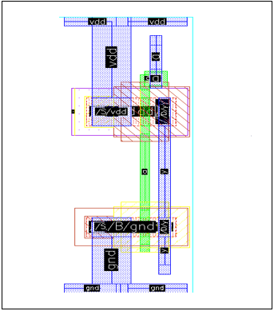
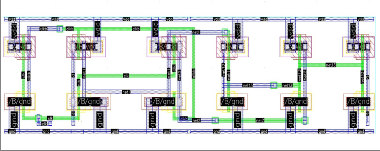
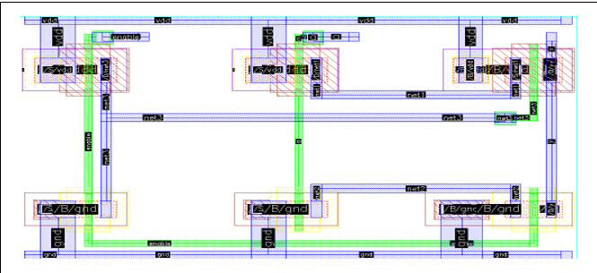
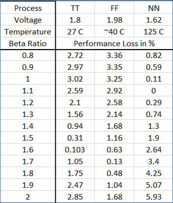

# Results

## Introduction

This chapter presents the overall results obtained during the development of the **45 nm CMOS Standard Cell Library** for ASIC design. The outcomes summarize the transistor sizing optimization, physical layout implementation, design rule verification, timing analysis, and Process-Voltage-Temperature (PVT) validation performed throughout the project.

The developed standard cell library consists of combinational and sequential logic cells designed using a common architecture and layout methodology. Representative cells were analyzed to evaluate timing performance and verify reliable operation under different operating conditions.

The results presented in this chapter demonstrate that the proposed design methodology successfully achieves balanced performance, layout regularity, and robustness, making the developed library suitable for digital ASIC design applications.

---
# Beta Ratio Optimization Results

Beta ratio optimization was performed to determine the optimum PMOS-to-NMOS width ratio that provides balanced rising and falling propagation delays for representative combinational cells.

Propagation delay simulations were carried out using Spectre on schematic-level designs while keeping the NMOS transistor width fixed at **120 nm**. The PMOS width was varied over a range of beta ratios, and the corresponding delays were measured.

The optimized beta ratios obtained for the representative cells are summarized in Table 6.1.

### Table 6.1 Optimized Beta Ratios

| Standard Cell | Optimum Beta Ratio |
|--------------|-------------------:|
| Inverter | 1.55 |
| NAND Gate | 1.2875 |
| NOR Gate | 1.90 |

Based on the optimization results, a common beta ratio of **1.5** was selected for the implementation of the standard cell library. This value provides a practical compromise between performance, layout uniformity, and ease of library development while maintaining balanced switching characteristics across multiple logic gates.
# Layout Development Results

The physical implementation of the standard cell library was carried out using the Cadence Virtuoso Layout Editor following standard ASIC layout design practices. Each cell was designed with a uniform height to facilitate row-based placement and improve compatibility with automated digital design flows.

A common standard cell height of **1.76 µm** was adopted throughout the library, while the cell widths were determined based on the complexity and transistor count of each logic function. The layouts were optimized to minimize area while maintaining proper routing and transistor placement.

During layout development, careful attention was given to transistor folding, diffusion sharing, metal routing, and power rail alignment. These techniques contributed to efficient utilization of silicon area and improved layout regularity.

The developed layouts include combinational logic cells such as inverters, NAND gates, NOR gates, XOR gates, multiplexers, and arithmetic cells, along with representative sequential elements. All layouts follow a consistent design methodology suitable for standard cell library development.

**Figure 6.1:** inverter Layout

**Figure 6.2:** d_latch_layout

**Figure 6.3:** tristate_buffer_layout

---

# DRC and LVS Verification Results

After layout implementation, each representative standard cell was verified using **Design Rule Check (DRC)** and **Layout Versus Schematic (LVS)** verification.

The DRC process ensured that all layouts satisfied the fabrication constraints specified by the 45 nm CMOS technology, including minimum spacing, enclosure, width, and overlap requirements. Successful completion of DRC confirms that the layouts comply with the technology design rules and are suitable for fabrication.

LVS verification was then performed to compare the extracted layout netlist with the original schematic. The LVS results confirmed that the electrical connectivity of the layouts matched their corresponding schematics, ensuring functional correctness.

The successful completion of both DRC and LVS verification demonstrates the correctness and manufacturability of the developed standard cells.
# Timing Analysis Results

Timing analysis was performed to evaluate the switching performance of the developed standard cells. Propagation delay measurements were carried out on representative combinational cells using Spectre simulations at the schematic level, while setup and hold time analyses were performed on representative sequential cells after layout implementation.

The measured propagation delays were used to determine the optimum beta ratio for the inverter, NAND, and NOR gates. A common beta ratio of **1.5** was selected for the standard cell library, providing balanced switching characteristics while maintaining a consistent layout methodology.

The setup and hold time measurements confirmed that the designed sequential cells satisfy the required timing constraints for reliable operation. The results demonstrate that the proposed library provides stable timing performance suitable for digital ASIC applications.

---

# PVT Validation Results

The robustness of the developed standard cell library was verified through Process-Voltage-Temperature (PVT) analysis using representative cells.

Performance was evaluated under the TT, FF, and SS process corners while varying the supply voltage from **1.62 V** to **1.98 V** and the operating temperature from **−40°C** to **125°C**.

The analysis showed that although the optimum beta ratio varies slightly under different operating conditions, the selected common beta ratio of **1.5** maintains balanced performance with only minor degradation. Similarly, the measured setup times remained within acceptable limits across all evaluated PVT conditions.

These results confirm that the proposed standard cell library exhibits reliable operation over a wide range of manufacturing and environmental conditions.

**Figure 6.4:** Summary of PVT Validation Results

---

# Developed Standard Cell Library

The developed 45 nm CMOS standard cell library includes a collection of representative digital logic cells commonly used in ASIC design. The library consists of combinational logic gates, arithmetic cells, sequential elements, and supporting utility cells developed using a common design methodology.

The library includes the following categories of cells:

- Basic combinational logic cells (Inverter, Buffer, NAND, NOR, XOR, XNOR)
- Arithmetic cells (Half Adder, Full Adder)
- Multiplexing logic (2:1 Multiplexer)
- Sequential cells (D Latches and D Flip-Flops)
- Special-purpose cells (Tie High and Tie Low)

Each cell follows a consistent architecture, transistor sizing methodology, and physical layout style, enabling their integration into larger digital systems.

---

# Overall Project Achievements

The major achievements of this project are summarized below.

- Successfully designed a representative **45 nm CMOS Standard Cell Library** for ASIC applications.
- Determined the optimum beta ratios for representative combinational logic cells through propagation delay analysis.
- Selected a common beta ratio of **1.5** for standardized library implementation.
- Developed compact physical layouts with a uniform standard cell height of **1.76 µm**.
- Successfully verified representative layouts using **Design Rule Check (DRC)** and **Layout Versus Schematic (LVS)** verification.
- Performed propagation delay, setup time, and hold time analyses for timing validation.
- Evaluated library robustness through Process-Voltage-Temperature (PVT) analysis.
- Established a consistent design methodology suitable for future expansion of the standard cell library.

---

# Conclusion

This chapter presented the overall results obtained during the development of the proposed 45 nm CMOS standard cell library. The results demonstrate that the adopted design methodology successfully achieves balanced transistor sizing, efficient physical layout implementation, successful physical verification, and reliable timing performance.

The PVT analysis further confirms that the representative cells maintain stable operation across different manufacturing and environmental conditions. Together, these results validate the effectiveness of the developed library and demonstrate its suitability for digital ASIC design applications.

The developed standard cell library provides a strong foundation for future work involving complete cell characterization, Liberty (.lib) generation, automated synthesis flows, and larger-scale ASIC implementations.

---
